# WiSP — routing-aware expert paging for memory-constrained MoE serving

> *WiSP pages experts like vLLM pages KV — and then decides, on one fixed GPU budget, how many bytes each side gets.*

<p align="center">
  
</p>

> **MV-WSA in 35 s** — on one fixed GPU budget (iso-VRAM), the controller sees the
> KV pool is mostly idle, reclaims those bytes into resident experts
> (cap 32→35, KV 2.79→1.53 GiB), and serves the same agent trace **1.19× faster**
> (`db`; `os` is 1.07×) with zero preemptions and byte-identical output. Measured on
> a real 24 GiB RTX 3090 (vLLM 0.11.2). The animation loops; an interactive
> walkthrough is in [`demo/animate/`](demo/animate/).
>
> This is the MV-WSA **online dual-resize controller** reported in the paper. Its
> code ships with the conference release (see [Roadmap](#roadmap)); **this v1**
> ships the expert pager + the static iso-VRAM and byte-identity reproductions below.

WiSP is a drop-in plug-in for [vLLM](https://github.com/vllm-project/vllm)
that lets a Mixture-of-Experts (MoE) model run on a GPU whose VRAM cannot
hold the full expert weights. The resident experts are treated as a cache;
the rest are paged in from pinned host memory on demand and evicted under a
single shared VRAM budget that the KV cache also draws from. On a 24 GiB
RTX 3090 this serves `Qwen3-30B-A3B` (~57 GiB in BF16) — a model that does
not otherwise fit — at up to **2.0× the decode throughput** of vanilla
vLLM's static `--cpu-offload-gb` at the same VRAM budget.

**Decode output is byte-identical to vanilla vLLM at temperature 0** on the
unquantized fused-MoE path: per-token combine is a weighted sum over each
token's routed expert set *in routing order*, so it is independent of which
physical scratch slot an expert occupies. WiSP only changes *where* the
weights live, not the math. Verify it yourself with
`scripts/check_byte_identity.py` (see below).

> Tested against **vLLM 0.11.2**. Capability claims (which models stock vLLM
> can/can't serve) are stated as of that version.

## What this release is (and isn't)

This is the artifact accompanying the WiSP paper. It ships the parts the
paper's headline numbers depend on:

- the **routing-aware expert pager** as a clean vLLM plug-in — a substrate
  built on the known idea of treating resident experts as a cache, packaged
  to be drop-in and byte-exact;
- the **iso-VRAM** reproduction on a real consumer card;
- the **byte-identity** check.

It does **not** include the from-scratch research simulator, the offline
upper-bound oracles, or the online dual-resize controller — those back
analysis figures and are out of scope for this v1.

## Install

```bash
# 1) install a torch matching your CUDA, then vLLM 0.11.2
pip install torch --index-url https://download.pytorch.org/whl/cu121
pip install vllm==0.11.2

# 2) install WiSP (registers the vLLM plug-in entry point)
pip install -e .
```

Or use the pinned image: `docker build -t wisp . && docker run --gpus all -it wisp`.

Once installed, the plug-in auto-registers with vLLM. Set
`WISP_PLUGIN_DISABLE=1` to leave it inert (useful for A/B baselining on the
same install).

## Quickstart

### Serve (OpenAI-compatible)

```bash
export WISP_MODE=paged WISP_CAP_EXPERTS=8
vllm serve Qwen/Qwen3-30B-A3B --enforce-eager \
    --gpu-memory-utilization 0.45 --max-model-len 4096
```

On a 24 GiB GPU this would OOM without the plug-in; with it, the model loads
in ~10 GiB and serves over HTTP.

### Offline (Python)

```python
from wisp.integrations.vllm import install_wisp_moe
install_wisp_moe()  # MUST be called before vLLM imports the model

from vllm import LLM, SamplingParams
llm = LLM("Qwen/Qwen3-30B-A3B", enforce_eager=True, gpu_memory_utilization=0.45)
print(llm.generate(["Hello, world."], SamplingParams(temperature=0))[0].outputs[0].text)
```

## Reproduce the paper claims

`reproduce.sh` runs the two headline results on any CUDA GPU with ≥ ~16 GiB
free and ~80 GiB host RAM (the master expert weights live pinned in DRAM):

```bash
bash reproduce.sh                 # byte-identity + iso-VRAM Pareto sweep
STEP=identity bash reproduce.sh   # just byte-identity
STEP=isovram  bash reproduce.sh   # just the iso-VRAM sweep
```

Byte-identity directly:

```bash
# vanilla reference streams weights from CPU so a >VRAM model fits (same math)
python scripts/check_byte_identity.py --mode vanilla --out vanilla.json --cpu-offload-gb 48 --gpu-memory-utilization 0.90
python scripts/check_byte_identity.py --mode wisp --cap-experts 8 --out wisp.json --gpu-memory-utilization 0.45
python scripts/check_byte_identity.py --compare vanilla.json wisp.json   # -> BYTE-IDENTICAL
```

## Configuration

| Env var | Default | Meaning |
| --- | --- | --- |
| `WISP_MODE` | `paged` | `paged` = LRU paging (memory-saving); `resident` = full residency (no paging); `copy` = naive full copy (correctness only). Legacy aliases `day2b`/`day2a`/`day1` still accepted. |
| `WISP_CAP_EXPERTS` | `min(num_experts, 24)` | scratch size (resident expert slots per layer) in `paged` mode. |
| `WISP_PLUGIN_DISABLE` | `0` | set `1` to leave the plug-in inert. |

## Layout

```
src/wisp/integrations/vllm/   the vLLM plug-in (install_wisp_moe)
src/wisp/oracle/cooccur.py    layer-conditioned routing co-occurrence
scripts/                      reproduction + benchmark scripts
reproduce.sh                  one-command reproduction
```

## Scope & limitations

- Byte-identity is guaranteed for the **unquantized fused-MoE** path that
  combines in routing order. Quantized / DeepGEMM / atomic-reduce kernels
  are out of scope for the guarantee.
- WiSP targets **single-stream / low-concurrency** decode on a constrained
  card. At high batch with overlap available, the trade-offs differ.
- Single-stream decode is **PCIe-bandwidth-bound**, not prediction-bound;
  speculative prefetch is a memory lever, not a latency lever (see the paper).
- The first load **pins the full expert weights (~model size) into host RAM**,
  so the host needs that much pinnable memory and the initial load can be slow
  — especially on a networked filesystem (we have seen ~15+ min for a 57 GiB
  model off a network volume). Loading from local NVMe is much faster, and the
  OS page cache makes subsequent loads quicker. This is a one-time cost, not a
  hang.

## Roadmap

This v1 ships the plug-in and the two headline reproductions. Planned next:

- [ ] Extend the byte-identity guarantee + tests to the quantized / FP8
      fused-MoE paths.
- [ ] Head-to-head comparison against other expert-offloading serving
      systems on the iso-VRAM Pareto.
- [ ] Online MV-WSA dual-resize controller (expert ↔ KV) wired into the
      multi-process serve loop — the controller shown in the demo above and
      reported in the paper (1.07–1.19× over the best fixed split).
- [ ] Broader model + hardware coverage (more MoE families, additional
      consumer / edge GPUs).

Contributions and issue reports are welcome.

## License

Apache-2.0. The copyright holder in `LICENSE` must be set per the project's
open-source sign-off before public release.

## Citation

```bibtex
@misc{wisp,
  title  = {WiSP: Working-Set Paging for Memory-Constrained Mixture-of-Experts Serving},
  author = {WiSP authors},
  year   = {2026},
  note   = {arXiv preprint}
}
```
